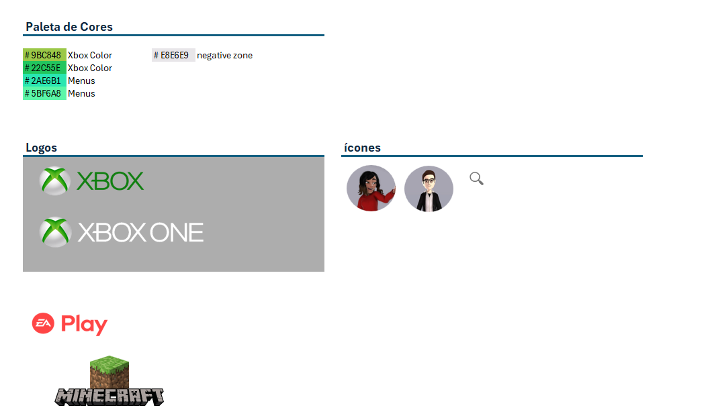
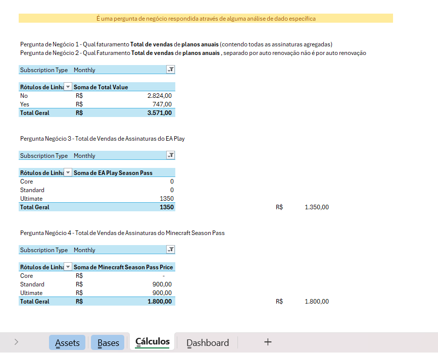

# Dashboard-de-vendas-Xbox-Excel

📊 **Dashboard de Vendas de Assinaturas Xbox**

Este projeto tem como objetivo apresentar uma análise visual e interativa das vendas de assinaturas Xbox, desenvolvida em Microsoft Excel.  
O dashboard foi criado a partir de uma base de dados bruta, passando por etapas de limpeza, transformação e visualização de dados.

---

## 🧠 Objetivos do Projeto

- Demonstrar a aplicação de conceitos de análise de dados utilizando o Excel;  
- Criar um dashboard dinâmico e interativo para acompanhamento das vendas de assinaturas Xbox;  
- Explorar técnicas de limpeza e tratamento de dados, fórmulas e gráficos dinâmicos.

---

## 🧩 Estrutura do Projeto

Abaixo está a organização dos arquivos e pastas do projeto:

📁 Dashboard-de-vendas-Xbox-Excel/
├── 📄 README.md → Documentação do projeto
├── 📊 Dashboard_Vendas_Xbox.xlsx → Arquivo principal do dashboard em Excel
├── 📁 dados/ → Contém a base de dados bruta e/ou tratada
│ └── vendas_xbox_raw.csv
├── 📁 imagens/ → Capturas de tela e visualizações do dashboard
│ └── preview_dashboard.png

---

## ⚙️ Etapas de Desenvolvimento

1. **Coleta de Dados:**  
   Importação da base de dados bruta com informações de vendas e assinaturas.

2. **Limpeza e Transformação:**  
   - Padronização de nomes, datas e categorias;  
   - Remoção de duplicidades e valores nulos;  
   - Criação de colunas auxiliares (como mês, região e tipo de assinatura).  

3. **Análise e Visualização:**  
   - Criação de tabelas dinâmicas para consolidação dos dados;  
   - Inserção de segmentadores para filtros dinâmicos;  
   - Desenvolvimento de gráficos interativos para análise de KPIs.  

4. **Montagem do Dashboard:**  
   - Organização do layout em seções de indicadores, gráficos e filtros;  
   - Aplicação de formatações condicionais e temas de cores;  
   - Inserção de títulos e legendas explicativas.  
---

## 📊 Visualização do Dashboard

Aqui está uma prévia do resultado final:

  
   
  
   
  

---

## 🧰 Ferramentas Utilizadas

- **Microsoft Excel** — para manipulação e visualização dos dados;  
- **Power Query** — para limpeza e transformação da base;  
- **Gráficos Dinâmicos** — para análise visual;  
- **Formatação Condicional e Layout Visual** — para estilização e experiência do usuário.
---
## 🧑‍💻 Autoria

Projeto desenvolvido por **Hevelyn Alves**  
📬 [LinkedIn](https://www.linkedin.com/in/hevelyn-alves/)
